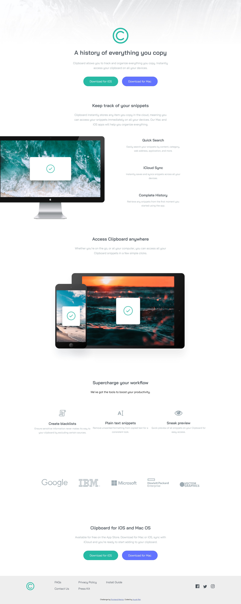

# Frontend Mentor - Clipboard landing page solution

This is a solution to the [Clipboard landing page challenge on Frontend Mentor](https://www.frontendmentor.io/challenges/clipboard-landing-page-5cc9bccd6c4c91111378ecb9). Frontend Mentor challenges help you improve your coding skills by building realistic projects.

## Table of contents

- [Overview](#overview)
  - [The challenge](#the-challenge)
  - [Screenshot](#screenshot)
  - [Links](#links)
- [My process](#my-process)
  - [Built with](#built-with)
  - [What I learned](#what-i-learned)
  - [Continued development](#continued-development)
- [Author](#author)

## Overview

### The challenge

Users should be able to:

- View the optimal layout for the site depending on their device's screen size
- See hover states for all interactive elements on the page

### Screenshot

!

### Links

- Solution URL: https://github.com/geekyayushofficial/clipboard-landing-page-master
- Live Site URL: https://geekyayushofficial.github.io/clipboard-landing-page-master/

## My process

### Built with

- Semantic HTML5 markup
- CSS custom properties
- Flexbox
- DESKTOP-first workflow

### What I learned

When I was starting this project, since I am beginner at this point of time, I faced a lot of difficulties choosing the correct class names, then applied the BEM convention for this. I also had problem choosing the components and layouts etc. in the 7-1 architecture of SASS, but through a lot of focus, hard-work and ofc Google Searches, I figured out these. Rest I used FlexBox for the layout, so got a good practice of it too...

### Continued development

In future I want to focus on CSS Grids and then using JavaScript too

## Author

- Website - [Ayush Raj](https://www.geekyayush.com)
- Frontend Mentor - [@geekyayushofficial](https://www.frontendmentor.io/profile/geekyayushofficial)
- Instagram - [@geekyayushofficial] (https://www.instagram.com/geekyayushofficial/)
